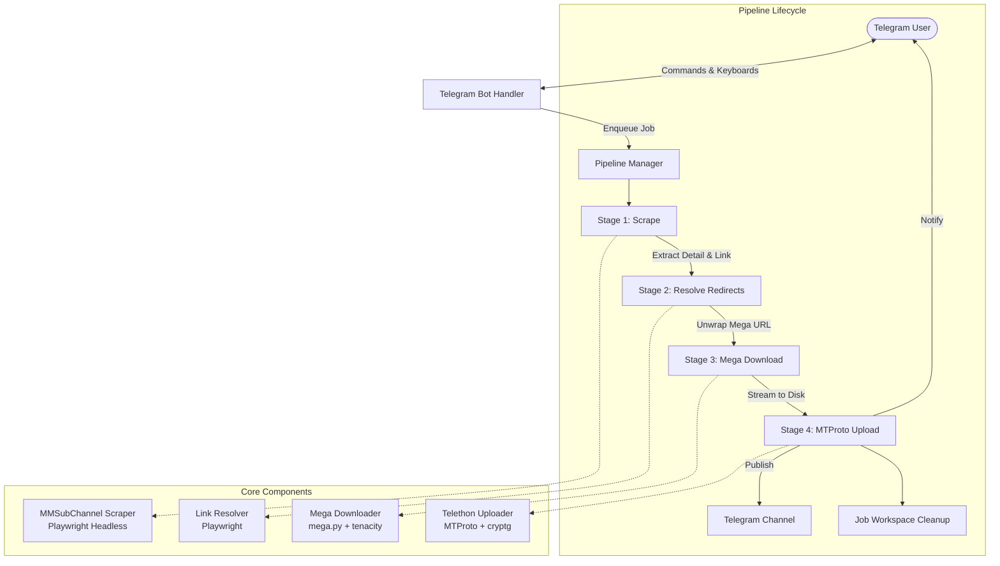

# System Architecture 🏛️

This document describes the architectural foundations of **Movie Man**, based on patterns refined from the `17plusone/movie-translator-bot` project.

---

## High-Level Architecture Diagram

---

## 1. Pipeline Stages State Machine

Each movie processing job transitions through explicit, immutable states defined in `JobStatus`:

| State | Description | Next Transitions |
| :--- | :--- | :--- |
| `QUEUED` | Job created and waiting for available concurrency slot | `SCRAPING` or `CANCELLED` |
| `SCRAPING` | Playwright loads movie detail page from MMSubChannel | `RESOLVING`, `DOWNLOADING`, `FAILED` |
| `RESOLVING` | Intermediate ad/shortener redirects followed to Mega.nz | `DOWNLOADING`, `FAILED` |
| `DOWNLOADING` | Chunk streaming from Mega servers to local temporary disk | `UPLOADING`, `FAILED` |
| `UPLOADING` | Telethon MTProto parallel multipart upload to Telegram | `COMPLETED`, `FAILED` |
| `COMPLETED` | Media delivered, user notified, workspace purged | Terminal |
| `FAILED` | Error logged, error message sent to user, workspace purged | Terminal |
| `CANCELLED` | User or operator halted execution via `/cancel` | Terminal |

---

## 2. Component Design & Responsibilities

### `app.scraper`
- **Headless Browser Execution**: Uses Playwright Chromium to execute dynamic JavaScript, handle hydration, and extract metadata (title, year, poster image, download anchors).
- **Selector Strategies**: Fallback CSS and XPath selectors ensure resilience if MMSubChannel updates its frontend React layout.

### `app.resolver`
- **Ad Shortener Traversal**: Follows HTTP 301/302 redirects, meta-refreshes, and client-side JavaScript navigation.
- **Skip Ad Automation**: Detects common skip buttons (e.g., "Skip Ad", "Get Link", "Proceed") and extracts destination `https://mega.nz/...` links.

### `app.mega`
- **Download Management**: Direct interface to Mega.nz API.
- **Fault-Tolerant Retries**: Integrates exponential backoff to handle transient network drops.

### `app.media.telethon_uploader`
- **Parallel Chunk Uploader**: Splits files into 512KB slices and broadcasts them concurrently over active MTProto sessions.
- **Native Video Attributes**: Injects `DocumentAttributeVideo` with `supports_streaming=True` so Telegram users can stream movies immediately without downloading first.

### `app.utils.compat`
- **Python Modernization Layer**: Provides runtime shims to seamlessly bridge Python 3.11, 3.12, and 3.13 changes (such as deprecation of `asyncio.coroutine`).

---

## 3. Concurrency & Cancellation Model

- **Global Job Registry**: `PipelineManager` tracks all active jobs in an in-memory registry keyed by UUID.
- **Cooperative Cancellation**: `JobContext.is_cancelled` is polled between network operations and chunk writes, immediately halting disk writes and closing open sockets if a user issues `/cancel`.
